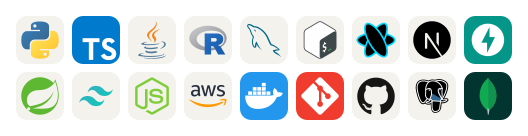

<!--
  README authored as part of an editorial "wow effect" redesign for @ReebalSami.
  Stack — every visual is rendered from a local file in assets/. ZERO runtime
  third-party image dependencies (no Vercel, no demolab, no skillicons.dev):
    - Hero:        custom (scripts/generate-hero.mjs)
    - Tech stack:  custom + vendored skill-icons (scripts/generate-tech-stack.mjs)
    - Numbers:     custom (scripts/generate-github-numbers.mjs)
                   = 2 cards: combined VOLUME+CADENCE, top languages
    - Calendar:    custom iso-projection + chibi web-slinger overlay (scripts/build-calendar.mjs)
    - Milestones:  custom (scripts/generate-milestones.mjs)
-->

<a href="https://reebal-sami.com">
  <picture>
    <source media="(prefers-color-scheme: dark)" srcset="./assets/hero-typing-dark.svg">
    
  </picture>
</a>

[reebal-sami.com](https://reebal-sami.com)&nbsp;·&nbsp;[LinkedIn](https://linkedin.com/in/reebal-sami)&nbsp;·&nbsp;[contact@reebal-sami.com](mailto:contact@reebal-sami.com)&nbsp;·&nbsp;Hamburg, DE

## About

I'm a **Data Scientist & AI Engineer** based in Hamburg. Five-plus years at **OTTO Group** as a *Bilanzbuchhalter* — SAP FI-CO/BPC, IFRS/HGB, UiPath RPA — then a deliberate pivot into ML/AI. Today I build end-to-end AI systems: multi-agent LLM pipelines, deep-learning vision, RAG, full-stack web on AWS.

## Currently

- Finishing my **M.Sc. thesis at FH Wedel** — *Document Intelligence and Knowledge Graph Construction*: OCR-free extraction with **modern document VLMs**, entity resolution, **GraphRAG** reasoning over local LLMs. Fully local, zero cloud.
- Working through **AWS Cloud Practitioner**, **AI Practitioner**, and **ML Engineer Associate** certifications.
- Shipping cloud-deployed ML projects on **AWS CDK**.

## What I Build

- **LLM-powered systems** — multi-agent apps (Agno / LangChain), crawlers, RAG, structured outputs with Pydantic
- **Deep Learning for Computer Vision** — ViT, DINOv2, ConvNeXt, ResNet-50, Grad-CAM / Attention Rollout
- **Classical ML** — bankruptcy prediction, recommenders, time series, econometrics
- **Full-stack web** — Next.js 16, React, Spring Boot, FastAPI, AWS CDK, Tailwind v4

## Tech Stack

<picture>
  <source media="(prefers-color-scheme: dark)" srcset="./assets/tech-stack-dark.svg">
  
</picture>

**AI/ML** &nbsp;·&nbsp; PyTorch · Hugging Face · LangChain · Agno · modern document VLMs · GraphRAG · DINOv2 · ConvNeXt · scikit-learn · pandas · NumPy · OpenCV · Grad-CAM

## GitHub by the numbers

<a href="https://github.com/ReebalSami">
  <picture>
    <source media="(prefers-color-scheme: dark)" srcset="./assets/numbers-stats-streak-dark.svg">
    
  </picture>
</a>

<a href="https://github.com/ReebalSami">
  <picture>
    <source media="(prefers-color-scheme: dark)" srcset="./assets/numbers-langs-dark.svg">
    
  </picture>
</a>

## Contributions in 3D

> Six months of commits, lifted into an isometric calendar — and a chibi web-slinger parkouring across the rooftops, sector by sector. Updates daily.

<picture>
  <source media="(prefers-color-scheme: dark)" srcset="./assets/metrics-dark.svg">
  
</picture>

## Milestones

<picture>
  <source media="(prefers-color-scheme: dark)" srcset="./assets/milestones-dark.svg">
  
</picture>

## Featured Work

> Flagship projects are **pinned above** — multi-agent LLM pipelines, deep-learning vision, recommenders, full-stack apps. The table below highlights additional work that complements the pinned grid.

| Project | Description | Stack |
|---|---|---|
| [**Biotech Regulatory RAG**](https://github.com/ReebalSami/biotech-regulatory-Retrieving-Chatbot-tool) | RAG-powered compliance assistant for biotech regulations — built in a team of 4 during the *Future Founder* program. Source-cited answers, interactive questionnaire, mobile-responsive. | Python · FastAPI · React · GPT-4 · RAG · Vector DB |
| [**HafenHut Web**](https://github.com/ReebalSami/hafenhut-web) | Commercial website and e-commerce frontend for **HafenHut®** — a protective solution for harbor piles and jetty structures. | Next.js · TypeScript · Tailwind · Sanity CMS · Stripe |
| [**Portfolio & RAG Chatbot**](https://reebal-sami.com) | My personal portfolio: 4 locales (incl. Arabic RTL), MDX blog, Typst-rendered CV, custom RAG chatbot over my own profile, deployed on AWS CDK. | Next.js 16 · Tailwind v4 · AWS CDK · next-intl · MDX · Typst |

## Languages I Speak

**German** (professional) · **English** (professional) · **Arabic** (native) · **Spanish** (learning, ~A2)

---

Open to **Data Scientist / AI Engineer** roles — Hamburg or remote DE, from Q2 2026. 
[reebal-sami.com](https://reebal-sami.com) — [LinkedIn](https://linkedin.com/in/reebal-sami) — [contact@reebal-sami.com](mailto:contact@reebal-sami.com)

